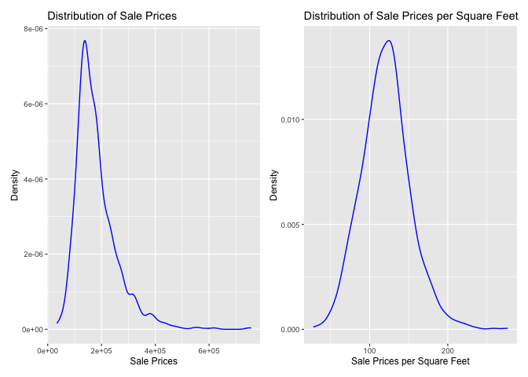
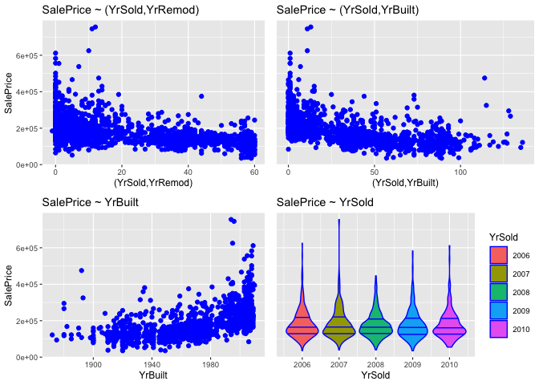
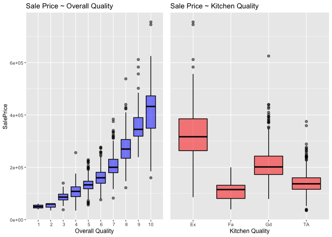
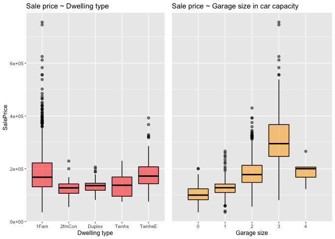
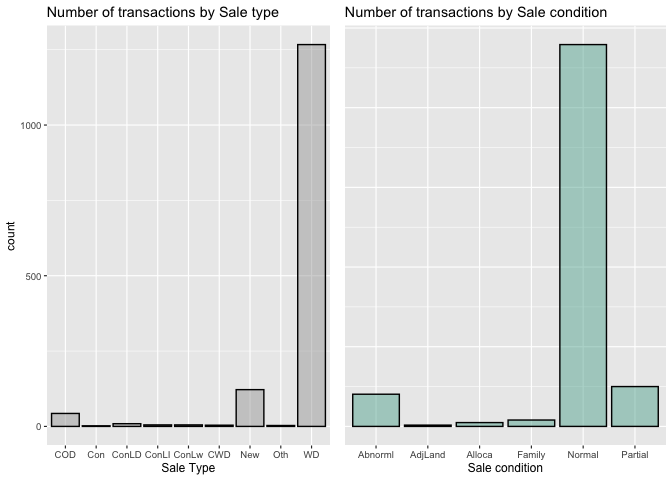
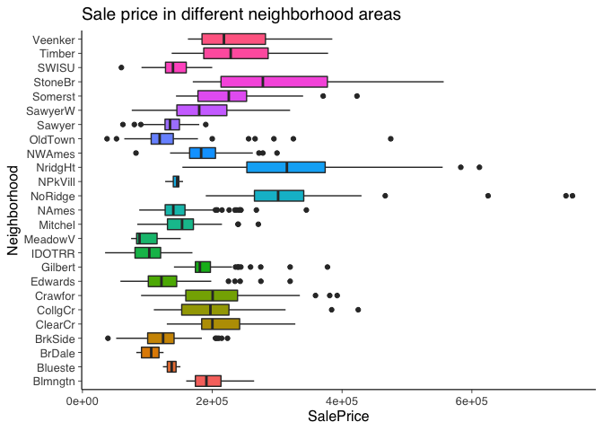
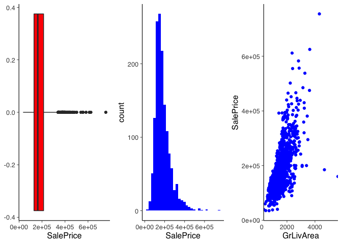
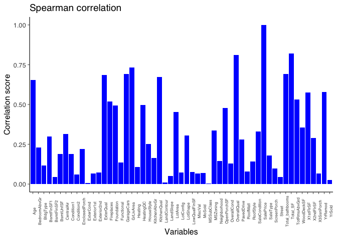
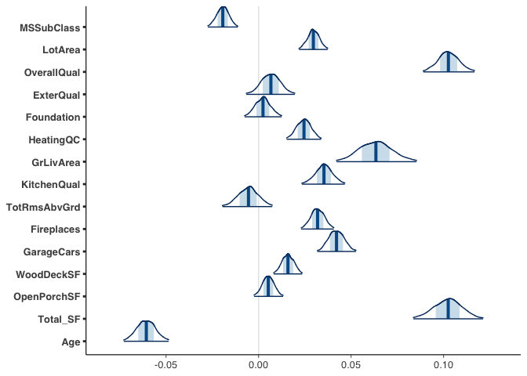
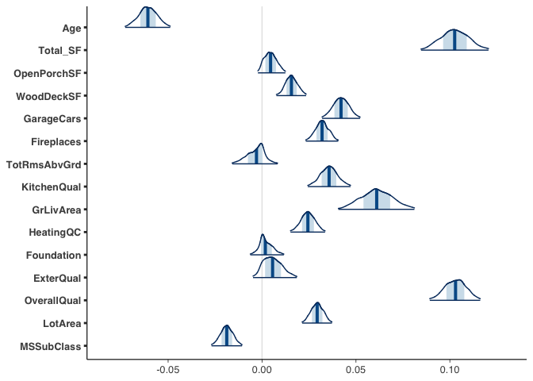

House Price Analysis
================

``` r
rm(list=ls())
```

``` r
library("rprojroot")
library("rstanarm")
library("rstantools")
library("loo")
library("ggplot2")
library("bayesplot")
library("dplyr")
library('patchwork')
library('cowplot')
library('mice')
library('gridExtra')
require('EnvStats')
require('visdat')
theme_set(bayesplot::theme_default(base_family = "sans"))
```

``` r
SEED <- 123
```

# Load data

``` r
df <- read.csv('dataset.csv')
```

``` r
df$YearBuilt = as.numeric(df$YearBuilt)
df$YearRemodAdd = as.numeric(df$YearRemodAdd)
df$YrSold = as.numeric(df$YrSold)
```

# Exploratory Data Analysis (EDA)

``` r
df$price_sqft <- df$SalePrice/df$GrLivArea
p1 <- ggplot(df, aes(SalePrice)) + 
  geom_density(alpha=0.1, colour='blue') +
  labs(title = 'Distribution of Sale Prices',x='Sale Prices', y='Density') +
  theme_gray(base_size = 9)
p2 <- ggplot(df, aes(price_sqft)) + 
  geom_density(alpha=0.1, colour='blue') +
  labs(title = 'Distribution of Sale Prices per Square Feet', x='Sale Prices per Square Feet', y='Density')+
  theme_gray(base_size = 9)
p1 + p2
```

<!-- -->

``` r
p3 <- ggplot(df, aes(x=GrLivArea,y=SalePrice, color=MSZoning)) +
  geom_point() + 
  labs(title = 'Sale Prices ~ Living Area', x='Living Area',y='Sale Prices')+
  theme_gray(base_size=9)
p4 <- ggplot(df, aes(x=TotalBsmtSF,y=SalePrice, color=MSZoning))+
  geom_point()+
  theme_gray(base_size = 9)+
  theme(axis.text.y = element_blank(),
        axis.ticks.y = element_blank(),
        axis.title.y = element_blank())+
  labs(title = 'Sale Prices ~ Basement Size', x='Basement size')

prow <- plot_grid(p3+theme(legend.position = 'none'),
                  p4+theme(legend.position = 'none'))
legend_b <- get_legend(p3 + theme(legend.position = 'bottom'))
plot_grid(prow, legend_b, ncol=1, rel_heights = c(1,0.2))
```

<!-- -->

``` r
p5 <- ggplot(df, aes(x=YrSold - YearRemodAdd, y=SalePrice)) +
  geom_point(color='blue') +
  labs(title = 'SalePrice ~ (YrSold,YrRemod)', x='(YrSold,YrRemod)',y='SalePrice')+
  theme_gray(base_size = 9)
p6 <- ggplot(df, aes(x=YrSold - YearBuilt, y=SalePrice)) +
  geom_point(color='blue') +
  labs(title = 'SalePrice ~ (YrSold,YrBuilt)', x='(YrSold,YrBuilt)',y='SalePrice')+
  theme_gray(base_size = 9)
p7 <- ggplot(df, aes(x=YearBuilt, y=SalePrice)) +
  geom_point(color='blue') +
  labs(title = 'SalePrice ~ YrBuilt', x='YrBuilt',y='SalePrice')+
  theme_gray(base_size = 9)
p8 <- ggplot(df, aes(x=YrSold, y=SalePrice, fill=as.factor(YrSold))) +
  geom_violin(color='blue', draw_quantiles = c(0.25, 0.5, 0.75))  +
  labs(title = 'SalePrice ~ YrSold', x='YrSold',y='SalePrice', fill = 'YrSold')+
  theme_gray(base_size = 9)
cowplot::plot_grid(p5, p6 + theme(axis.text.y = element_blank(),
                                  axis.ticks.y = element_blank(),
                                  axis.title.y = element_blank()),
                   p7, p8 + theme(axis.text.y = element_blank(),
                                  axis.ticks.y = element_blank(),
                                  axis.title.y = element_blank()),
                   nrow = 2, ncol = 2)
```

<!-- -->

``` r
p9 <- ggplot(df, aes(x=OverallQual, y=SalePrice, group=OverallQual)) + 
  geom_boxplot(alpha=0.5, color='black', fill='blue') +
  theme(legend.position = "right") +
  scale_x_discrete(name = 'Overall Quality',limits=seq(1,10,1)) +
  labs(title = 'Sale Price ~ Overall Quality') + 
  theme_gray(base_size=9)
p10 <- ggplot(df, aes(x=KitchenQual, y=SalePrice, group=KitchenQual)) + 
  geom_boxplot(alpha=0.5, color='black', fill='red') +
  theme(legend.position = "right") +
  scale_x_discrete(name = 'Kitchen Quality') +
  labs(title='Sale Price ~ Kitchen Quality') + 
  theme_gray(base_size=9)
options(repr.plot.width = 20, repr.plot.height = 8)
cowplot::plot_grid(p9, p10 + theme(axis.text.y = element_blank(),
                                  axis.ticks.y = element_blank(),
                                  axis.title.y = element_blank()),
                   nrow = 1)
```

<!-- -->

``` r
p11 <- ggplot(df, aes(x=BldgType, y=SalePrice, group=BldgType)) + 
  geom_boxplot(alpha=0.5, color='black', fill='red') +
  theme(legend.position = "right") +
  scale_x_discrete(name = 'Dwelling type') +
  labs(title='Sale price ~ Dwelling type') + 
  theme_gray(base_size=9)

p12 <- ggplot(df, aes(x=GarageCars, y=SalePrice, group=GarageCars)) + 
  geom_boxplot(alpha=0.5, color='black', fill='orange') +
  theme(legend.position = "right") +
  scale_x_discrete(name = 'Garage size', limits=seq(0,4,1)) +
  labs(title='Sale price ~ Garage size in car capacity') + 
  theme_gray(base_size=9)
options(repr.plot.width = 20, repr.plot.height = 8)
cowplot::plot_grid(p11, p12 + theme(axis.text.y = element_blank(),
                                  axis.ticks.y = element_blank(),
                                  axis.title.y = element_blank()),
                   nrow = 1)
```

<!-- -->

``` r
p13 <- ggplot(df, aes(x=SaleType)) + 
  geom_bar(alpha=0.5, color='black', fill='darkgrey') +
  theme(legend.position = "right") +
  scale_x_discrete(name = 'Sale Type') +
  labs(title='Number of transactions by Sale type') + 
  theme_gray(base_size=9)

p14 <- ggplot(df, aes(x=SaleCondition)) + 
  geom_bar(alpha=0.5, color='black', fill='#69b3a2') +
  theme(legend.position = "right") +
  scale_x_discrete(name = 'Sale condition') +
  labs(title='Number of transactions by Sale condition') + 
  theme_gray(base_size=9)
options(repr.plot.width = 20, repr.plot.height = 8)
cowplot::plot_grid(p13, p14 + theme(axis.text.y = element_blank(),
                                  axis.ticks.y = element_blank(),
                                  axis.title.y = element_blank()),
                   nrow = 1)
```

<!-- -->

``` r
p15 <- ggplot(df, aes(x = SalePrice, y=Neighborhood, group=Neighborhood, fill=Neighborhood))+
  geom_boxplot() +
  theme(legend.position = "none") +
  labs(title = "Sale price in different neighborhood areas")
p15
```

<!-- --> # Data
processing

## Transforming categorical and ordinal variables

``` r
categorical_varnames = c('MSSubClass', 'MSZoning','Street','LotShape','LandContour','LotConfig','LandSlope','Neighborhood',
                        'Condition1', 'Condition2','BldgType','HouseStyle','RoofStyle', 'RoofMatl','Exterior1st', 'Exterior2nd','MasVnrType',                     'Foundation','Heating','CentralAir','Electrical','Functional','GarageType','SaleType', 'SaleCondition')

ordinal_varnames = c('OverallCond','OverallQual','YearBuilt','YearRemodAdd','ExterQual','ExterCond','BsmtQual','BsmtCond','BsmtExposure','BsmtFinType1','BsmtFinType2','HeatingQC','KitchenQual','GarageFinish','GarageQual','GarageCond','PavedDrive','YrSold')

numerical_varnames = c('LotArea','MasVnrArea','BsmtFinSF1','BsmtFinSF2','BsmtUnfSF','TotalBsmtSF','1stFlrSF', '2ndFlrSF', 'LowQualFinSF', 'GrLivArea','BsmtFullBath','BsmtHalfBath', 'FullBath', 'HalfBath','BedroomAbvGr', 'KitchenAbvGr','TotRmsAbvGrd','Fireplaces','GarageCars','WoodDeckSF', 'OpenPorchSF','EnclosedPorch', '3SsnPorch', 'ScreenPorch')
```

``` r
# Factorize categorical variables
df[categorical_varnames] <- lapply(df[categorical_varnames], factor)
df[,categorical_varnames] <- sapply(df[, (categorical_varnames)], unclass)
```

``` r
# Transform ordinal variables

df <- dplyr::mutate(df, ExterQual = dplyr::recode_factor(ExterQual,'Po'=1,'Fa'=2,'TA'=3,'Gd'=4,'Ex'=5,.ordered = TRUE))
df <- dplyr::mutate(df, ExterCond = dplyr::recode_factor(ExterCond,'Po'=1,'Fa'=2,'TA'=3,'Gd'=4,'Ex'=5,.ordered = TRUE))
df <- dplyr::mutate(df, BsmtQual = dplyr::recode_factor(BsmtQual,'Po'=1,'Fa'=2,'TA'=3,'Gd'=4,'Ex'=5,.ordered = TRUE))
df <- dplyr::mutate(df, BsmtCond = dplyr::recode_factor(BsmtCond,'Po'=1,'Fa'=2,'TA'=3,'Gd'=4,'Ex'=5,.ordered = TRUE))
df <- dplyr::mutate(df, BsmtExposure = dplyr::recode_factor(BsmtExposure,'NA'=1,'No'=2,'Mn'=3,'Av'=4,'Gd'=5,.ordered = TRUE))
df <- dplyr::mutate(df, BsmtFinType1 = dplyr::recode_factor(BsmtFinType1,'NA'=1,'Unf'=2,'LwQ'=3,'Rec'=4,'BLQ'=5,'ALQ'=6,'GLQ'=7,.ordered = TRUE))
df <- dplyr::mutate(df, BsmtFinType2 = dplyr::recode_factor(BsmtFinType2,'NA'=1,'Unf'=2,'LwQ'=3,'Rec'=4,'BLQ'=5,'ALQ'=6,'GLQ'=7,.ordered = TRUE))
df <- dplyr::mutate(df, HeatingQC = dplyr::recode_factor(HeatingQC,'Po'=1,'Fa'=2,'TA'=3,'Gd'=4,'Ex'=5,.ordered = TRUE))
df <- dplyr::mutate(df, KitchenQual = dplyr::recode_factor(KitchenQual,'Po'=1,'Fa'=2,'TA'=3,'Gd'=4,'Ex'=5,.ordered = TRUE))
df <- dplyr::mutate(df, GarageFinish = dplyr::recode_factor(GarageFinish,'NA'=1,'Unf'=2,'RFn'=3,'Fin'=4,.ordered = TRUE))
df <- dplyr::mutate(df, GarageQual = dplyr::recode_factor(GarageQual,'NA'=1,'Po'=2,'Fa'=3,'TA'=4,'Gd'=5,'Ex'=6,.ordered = TRUE))
df <- dplyr::mutate(df, GarageCond = dplyr::recode_factor(GarageCond,'NA'=1,'Po'=2,'Fa'=3,'TA'=4,'Gd'=5,'Ex'=6,.ordered = TRUE))
df <- dplyr::mutate(df, PavedDrive = dplyr::recode_factor(PavedDrive,'N'=1,'P'=2,'Y'=3,.ordered = TRUE))
```

## Missing values

``` r
vis_miss(df, sort_miss = TRUE) +
  theme(axis.text.x = element_text(size=6, angle=90))
```

<!-- -->

``` r
df <- df[, !(colnames(df) %in% c('Alley', 'LotFrontage', 'FireplaceQu', 'PoolQC', 'Fence', 'MiscFeature'))]
```

``` r
df <- subset(df, !(PoolArea %in% c(512., 519., 555., 576., 648., 738.)))
df <- df[, !(colnames(df) %in% c('PoolArea','Utilities', 'GarageYrBlt', 'GarageArea'))]
```

``` r
varnames <-  names(which(sapply(df, anyNA)))
varnames
```

    ##  [1] "MasVnrType"   "MasVnrArea"   "BsmtQual"     "BsmtCond"     "BsmtExposure"
    ##  [6] "BsmtFinType1" "BsmtFinType2" "Electrical"   "GarageType"   "GarageFinish"
    ## [11] "GarageQual"   "GarageCond"

``` r
# perform mice imputation, based on random forests

miceMod <- mice(df[, !names(df) %in% varnames], method="rf")
```

    ## 
    ##  iter imp variable
    ##   1   1
    ##   1   2
    ##   1   3
    ##   1   4
    ##   1   5
    ##   2   1
    ##   2   2
    ##   2   3
    ##   2   4
    ##   2   5
    ##   3   1
    ##   3   2
    ##   3   3
    ##   3   4
    ##   3   5
    ##   4   1
    ##   4   2
    ##   4   3
    ##   4   4
    ##   4   5
    ##   5   1
    ##   5   2
    ##   5   3
    ##   5   4
    ##   5   5

``` r
df <- complete(miceMod)  # generate the completed data.
```

## Outliers

``` r
ol_IQR = function(z){
  z = na.omit(z)
  names(z) = NULL
  p25 = quantile(z)[2]
  p75 = quantile(z)[4]
  iqr = (p75-p25)
  iqr_l = p25-1.5*iqr
  iqr_u = p75+1.5*iqr
  w = which(z<iqr_l | z>iqr_u)
  
  list(idx = w,
       val = z[w],
       mu = mean(z),
       thres_l =iqr_l,
       thres_u = iqr_u
  )
}
ols_IQR = apply(df[59],2,ol_IQR)
length(ols_IQR$SalePrice$idx)
```

    ## [1] 63

``` r
ol_SD = function(z){
  z = na.omit(z)
  sz = scale(z)
  w = which(abs(sz)>3)
  list(idx = w,
       val = z[w],
       mu = mean(z),
       thres_l = mean(z) - 3*sd(z),
       thres_u = mean(z) + 3*sd(z)
  )
}
ols_SD = apply(df[59],2,ol_SD)
length(ols_SD$SalePrice$idx)
```

    ## [1] 22

``` r
p16 <- ggplot(data=df, aes(x=SalePrice)) + geom_boxplot(fill='red')
p17 <- ggplot(data=df, aes(x=SalePrice)) + geom_histogram(fill='blue')
p18 <- ggplot(data = df, aes(x=GrLivArea,y=SalePrice)) + geom_point(color='blue') +
  scale_x_discrete(limits=seq(0,4000,2000))
grid.arrange(p16,p17,p18,nrow=1)
```

<!-- -->

``` r
# Only exclude two data points with unnormal correlation between GrLivArea and SalePrice

df <- subset(df, GrLivArea < 4500)
```

# Feature engineering

## Add variables

``` r
df$Total_SF = df$TotalBsmtSF + df$X1stFlrSF + df$X2ndFlrSF
df$Total_bathbooms = df$BsmtFullBath + df$BsmtHalfBath + df$FullBath + df$HalfBath
df$Age = df$YrSold - df$YearBuilt
df$YrRemod = df$YrSold - df$YearRemodAdd
```

``` r
df <- df[, !(colnames(df) %in% c('TotalBsmtSF','1stFlrSF','2ndFlrSF','BsmtFullBath','BsmtHalfBath','YearBuilt','YearRemodAdd','price_sqft','FullBath','HalfBath','Id'))]
```

``` r
df <- as.data.frame(sapply(df, as.numeric))
```

``` r
predictors <- df[,-which(names(df) == 'SalePrice')]
predictors <- scale(predictors)
```

``` r
outcome <- as.data.frame(log(df$SalePrice))
```

``` r
final_df = cbind(outcome, predictors)
```

``` r
colnames(final_df)[1] = 'SalePrice'
```

# Modeling

## Spearman correlation

``` r
correlation <- as.data.frame(cor(final_df[,colnames(final_df)], method='spearman'))
```

``` r
correlation <-  abs(correlation[1])
```

``` r
ggplot(correlation, aes(x= rownames(correlation), y=SalePrice)) + 
  geom_bar(stat='identity', fill='blue') +
  theme(axis.text.x = element_text(size=6, angle=90)) +
  labs(title = 'Spearman correlation', x='Variables', y='Correlation score')
```

<!-- -->

``` r
hprice <- c("SalePrice")
prenames <- c('Total_SF', 'OverallQual', 'GrLivArea', 'Total_bathrooms', 'GarageCars',
       'ExterQual', 'KitchenQual', 'BsmtQual', 'Age', 'GarageFinish',
       'YrRemode', 'Foundation', 'TotRmsAbvGrd', 'Fireplaces', 'HeatingQC',
       'OpenPorchSF', 'MSSubClass', 'LotArea', 'MasVnrArea', 'WoodDeckSF')
predictors <- colnames(final_df[,which(names(final_df) %in% prenames)])
predictors
```

    ##  [1] "MSSubClass"   "LotArea"      "OverallQual"  "ExterQual"    "Foundation"  
    ##  [6] "HeatingQC"    "GrLivArea"    "KitchenQual"  "TotRmsAbvGrd" "Fireplaces"  
    ## [11] "GarageCars"   "WoodDeckSF"   "OpenPorchSF"  "Total_SF"     "Age"

``` r
df <- subset(final_df, select = c("SalePrice", predictors))
```

## Bayesian linear models with horseshoe prior regularization

``` r
# Fit a regression model with default weak priors
fit0 <- stan_glm(SalePrice ~ ., data = df, seed = SEED, refresh=0)
```

``` r
fit0
```

    ## stan_glm
    ##  family:       gaussian [identity]
    ##  formula:      SalePrice ~ .
    ##  observations: 1452
    ##  predictors:   16
    ## ------
    ##              Median MAD_SD
    ## (Intercept)  12.0    0.0  
    ## MSSubClass    0.0    0.0  
    ## LotArea       0.0    0.0  
    ## OverallQual   0.1    0.0  
    ## ExterQual     0.0    0.0  
    ## Foundation    0.0    0.0  
    ## HeatingQC     0.0    0.0  
    ## GrLivArea     0.1    0.0  
    ## KitchenQual   0.0    0.0  
    ## TotRmsAbvGrd  0.0    0.0  
    ## Fireplaces    0.0    0.0  
    ## GarageCars    0.0    0.0  
    ## WoodDeckSF    0.0    0.0  
    ## OpenPorchSF   0.0    0.0  
    ## Total_SF      0.1    0.0  
    ## Age          -0.1    0.0  
    ## 
    ## Auxiliary parameter(s):
    ##       Median MAD_SD
    ## sigma 0.1    0.0   
    ## 
    ## ------
    ## * For help interpreting the printed output see ?print.stanreg
    ## * For info on the priors used see ?prior_summary.stanreg

``` r
# Plot posterior marginals of coefficients
p0 <- mcmc_areas(as.matrix(fit0), pars=vars(-'(Intercept)',-sigma),
                 prob_outer=0.95, area_method = "scaled height")
p0 <- p0 + scale_y_discrete(limits = rev(levels(p0$data$parameter)))
p0
```

<!-- -->

``` r
# Fit a regression model with regularized horseshoe prior assuming only some covariates are relevant
# I next use regularized horseshoe prior, assuming that the expected number of relevant predictors is near $p_0=10$.

p <- ncol(df)
n <- nrow(df)
p0 <- 10
slab_scale <- sd(df$SalePrice)/sqrt(p0)*sqrt(0.3)
global_scale <- p0 / (p - p0) / sqrt(n)
fit1 <- stan_glm(SalePrice ~ ., data = df, seed = SEED,
                 prior=hs(global_scale=global_scale, slab_scale=slab_scale),
                 refresh=0)
```

``` r
fit1
```

    ## stan_glm
    ##  family:       gaussian [identity]
    ##  formula:      SalePrice ~ .
    ##  observations: 1452
    ##  predictors:   16
    ## ------
    ##              Median MAD_SD
    ## (Intercept)  12.0    0.0  
    ## MSSubClass    0.0    0.0  
    ## LotArea       0.0    0.0  
    ## OverallQual   0.1    0.0  
    ## ExterQual     0.0    0.0  
    ## Foundation    0.0    0.0  
    ## HeatingQC     0.0    0.0  
    ## GrLivArea     0.1    0.0  
    ## KitchenQual   0.0    0.0  
    ## TotRmsAbvGrd  0.0    0.0  
    ## Fireplaces    0.0    0.0  
    ## GarageCars    0.0    0.0  
    ## WoodDeckSF    0.0    0.0  
    ## OpenPorchSF   0.0    0.0  
    ## Total_SF      0.1    0.0  
    ## Age          -0.1    0.0  
    ## 
    ## Auxiliary parameter(s):
    ##       Median MAD_SD
    ## sigma 0.1    0.0   
    ## 
    ## ------
    ## * For help interpreting the printed output see ?print.stanreg
    ## * For info on the priors used see ?prior_summary.stanreg

``` r
# Plot posterior marginals of coefficients

p1 <- mcmc_areas(as.matrix(fit1), pars=vars(-'(Intercept)',-sigma),
                 prob_outer=0.95, area_method = "scaled height")
p1 <- p1 + scale_y_discrete(limits = rev(levels(p1$df$parameter)))
p1
```

<!-- -->
